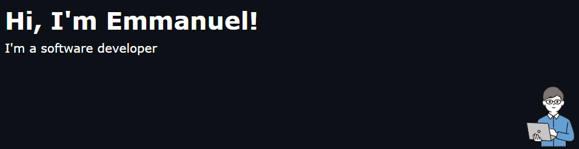
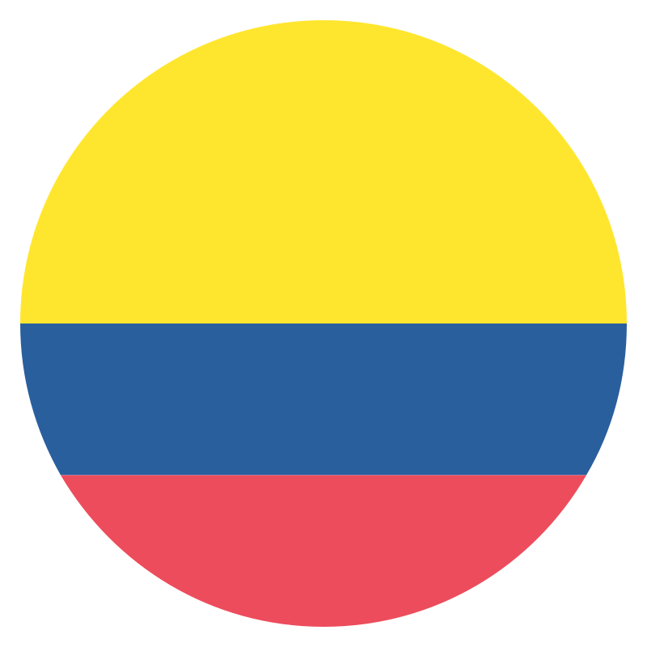

## Welcome to my page!

 I'm from  <b>Colombia</b>, currently living in <b>La Ceja</b>. 

<h3>Things I code with</h3>

   
   
   
   
   
   
   
   
   
   
   
   
   
   
   
   
   
   
   
   

