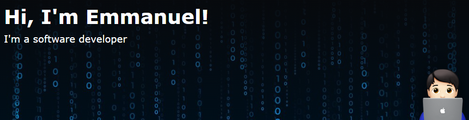

<h3>Welcome to my page!</h3>

I'm from  <b>Colombia</b>, currently living in <b>La Ceja</b>.

<h3>Things I code with</h3>

<!-- Front-end Table -->
<table cellpadding="10" cellspacing="0" width="100%">
  <thead>
    <tr>
      <th colspan="8">Front-end</th>
    </tr>
  </thead>
  <tbody>
    <tr>
      <td></td>
      <td></td>
      <td></td>
      <td></td>
      <td></td>
      <td></td>
      <td></td>
      <td></td>
    </tr>
  </tbody>
</table>

<!-- Back-end Table -->
<table cellpadding="10" cellspacing="0">
  <thead>
    <tr>
      <th colspan="12">Back-end</th>
    </tr>
  </thead>
  <tbody>
    <tr>
      <td></td>
      <td></td>
      <td></td>
      <td></td>
      <td></td>
      <td></td>
      <td></td>
      <td></td>
      <td></td>
      <td></td>
      <td></td>
      <td></td>
    </tr>
  </tbody>
</table>

<!-- Databases Table -->
<table cellpadding="10" cellspacing="0">
  <thead>
    <tr>
      <th colspan="3">Databases</th>
    </tr>
  </thead>
  <tbody>
    <tr>
      <td></td>
      <td></td>
      <td></td>
    </tr>
  </tbody>
</table>

<!-- Android and IOS Development Table -->
<table cellpadding="10" cellspacing="0">
  <thead>
    <tr>
      <th colspan="4">Android and IOS Development</th>
    </tr>
  </thead>
  <tbody>
    <tr>
      <td></td>
      <td></td>
      <td></td>
      <td></td>
    </tr>
  </tbody>
</table>

<h3>My stars ⭐</h3>

  

